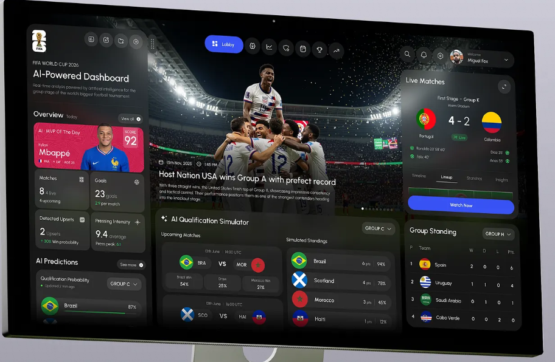

# PROBLEMA
Estamos proximos da copa do mundo 2026 de futebol. Esse período é muito importante para os brasileiros, pois somos apaixonados por futebol. O problema é que as informações disponíveis para a copa do mundo 2026 está descentralizada na internet, o que dificulta encontrar rapidamente diversas informações úteis no dia-a-dia.

# OBJETIVO
Criar um website, sem login, onde poderemos encontrar as principais informações sobre a copa do mundo 2026 de futebol. Principalmente as do Brasil.
# DESENVOLVIMENTO

## TASK 1
criar toda estrutura de pastas e arquivos do projeto. Utilizar o template anexado em  

## TASK 2
criar na rota / um cronometro bem grande centralizado na tela até o horário da convocação. Mostrar abaixo a data, horario, local, onde assistir e se possivel os links.
